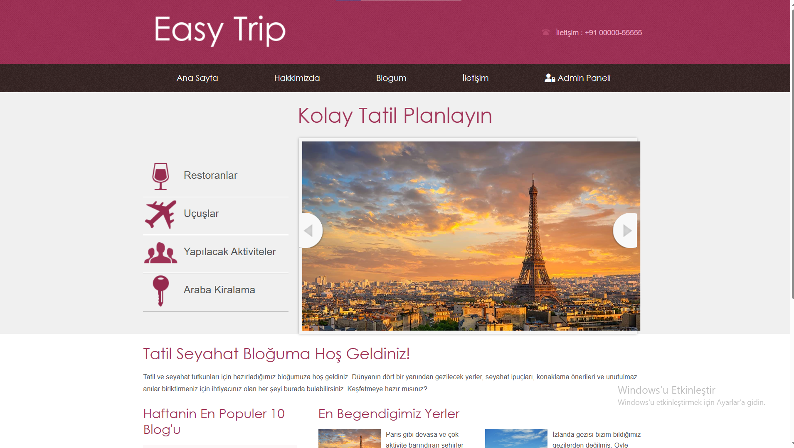
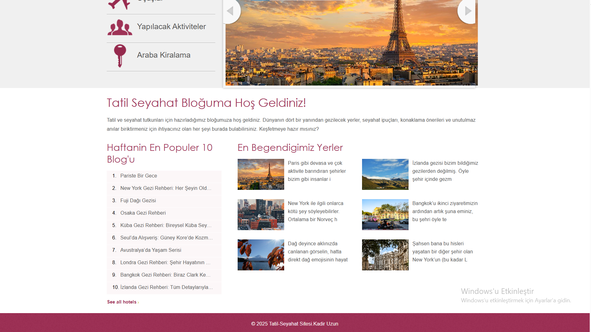
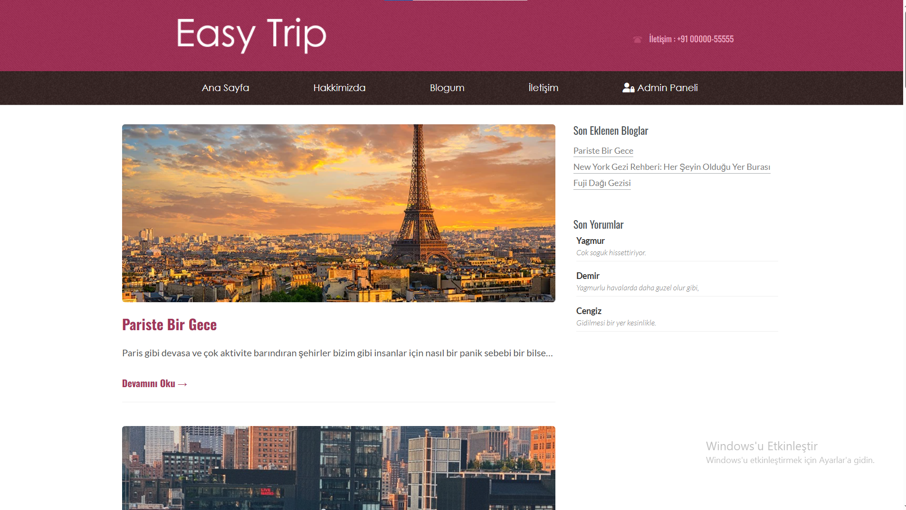
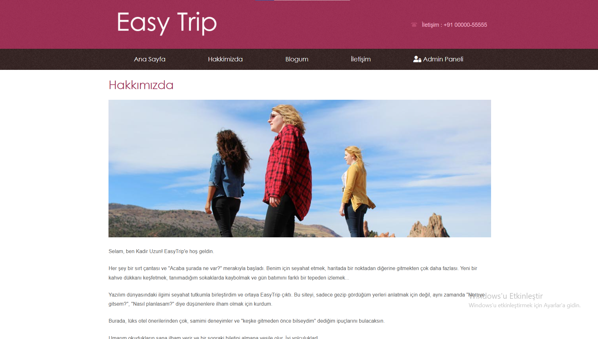
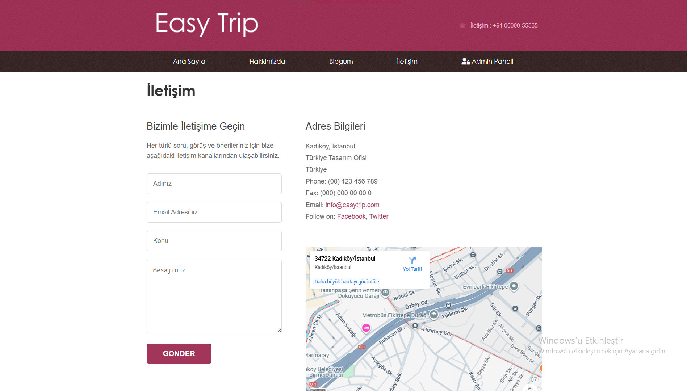
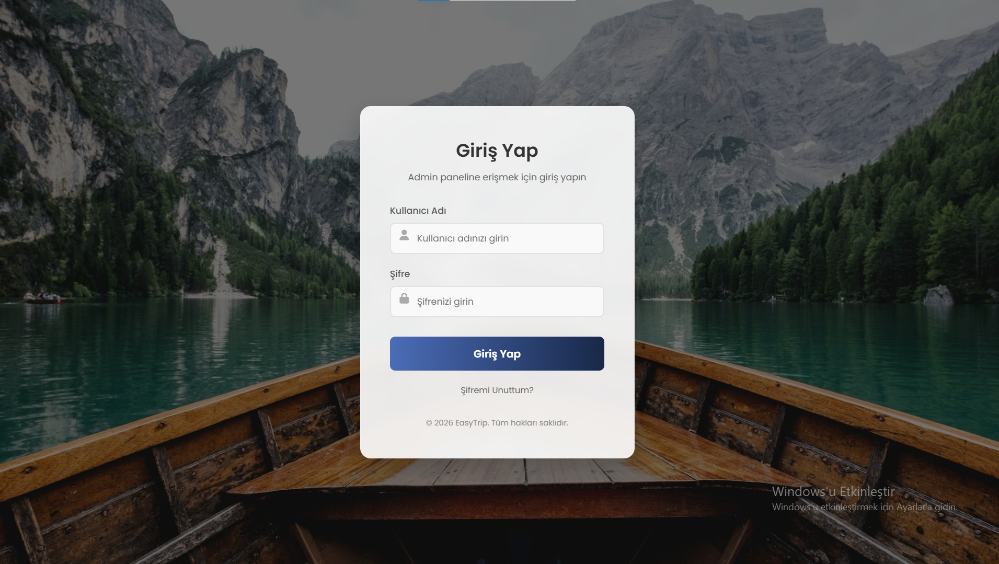
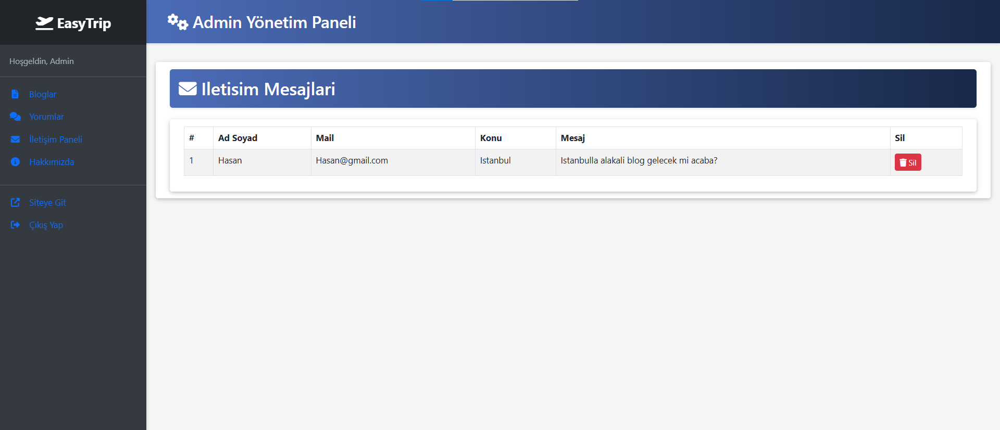

# ✈️ Tatil & Seyahat Blog Sitesi

Bu proje, YouTube'da **Murat Yücedağ** tarafından hazırlanan *"50 Derste Asp.Net Mvc ile Tatil & Seyahat Sitesi"* eğitimi kapsamında geliştirilmiştir. Proje, hem kullanıcılar için interaktif bir blog deneyimi sunmayı hem de yöneticiler için kapsamlı bir içerik yönetim paneli sağlamayı amaçlamaktadır.

## 📖 Proje Hakkında

Bu projede ASP.NET MVC 5 mimarisi kullanılarak uçtan uca bir blog sitesi geliştirilmiştir. Geliştirme sürecinde teorik bilgiler pratiğe dökülmüş; **Code First** yaklaşımından **Session** yönetimine, güvenlik önlemlerinden veritabanı ilişkilerine kadar pek çok yapı aktif olarak kullanılmıştır.

---

## 💻 Proje Özellikleri

### 🔐 Yönetim Paneli (Admin)
* **Tam Kontrol (CRUD):** Blog yazıları, kullanıcı yorumları ve iletişim mesajları üzerinde Ekleme, Silme ve Güncelleme işlemleri.
* **İçerik Yönetimi:** Yeni blog gönderilerinin dinamik olarak oluşturulması ve yayınlanması.
* **Moderasyon:** Gelen kullanıcı yorumlarının ve iletişim mesajlarının admin tarafından onaylanması veya silinmesi.
* **Güvenlik:** Admin paneline yetkisiz erişimi engellemek için `[Authorize]` ve `Session` kontrolleri.

### 🌐 Kullanıcı Arayüzü (UI)
* **Blog Okuma:** Ziyaretçilerin seyahat yazılarını ve detaylarını görüntüleyebilmesi.
* **Etkileşim:** Blog yazılarına yorum yapabilme özelliği.
* **İletişim:** Ziyaretçilerin site yöneticisine mesaj gönderebileceği iletişim formu.

---

## 🛠 Kullanılan Teknolojiler ve Mimari

Proje geliştirilirken aşağıdaki teknolojiler ve yaklaşımlar benimsenmiştir:

| Kategori | Teknoloji / Yaklaşım |
| :--- | :--- |
| **Mimari** | Model-View-Controller (MVC) 5 |
| **Veritabanı** | MS SQL Server |
| **ORM** | Entity Framework (Code First) |
| **Programlama Dili** | C# |
| **Frontend** | HTML5, CSS3, Bootstrap |

### ⚙️ Teknik Detaylar
* **Attribute Kullanımı:** Controller tarafında `[HttpGet]` ve `[HttpPost]` işlevlerinin etkin kullanımı.
* **Validasyon:** Veri bütünlüğünü sağlamak için Server-side validation işlemleri.
* **Güvenlik:** `Authorize` attribute'u ile güvenli erişim ve `SessionTimeOut` kontrolleri.

---

## 👏 Teşekkür
Bu projenin geliştirilmesindeki katkıları ve rehberliği için **Murat Yücedağ** hocama teşekkür ederim.

---
---

## 📷 Projeden Kareler

  
  &nbsp; &nbsp; &nbsp; &nbsp;
  
 &nbsp; &nbsp; &nbsp; &nbsp;
  
 &nbsp; &nbsp; &nbsp; &nbsp;
  
&nbsp; &nbsp; &nbsp; &nbsp;
  
&nbsp; &nbsp; &nbsp; &nbsp;
  
&nbsp; &nbsp; &nbsp; &nbsp;
  
&nbsp; &nbsp; &nbsp; &nbsp;
  
&nbsp; &nbsp; &nbsp; &nbsp;
  

---